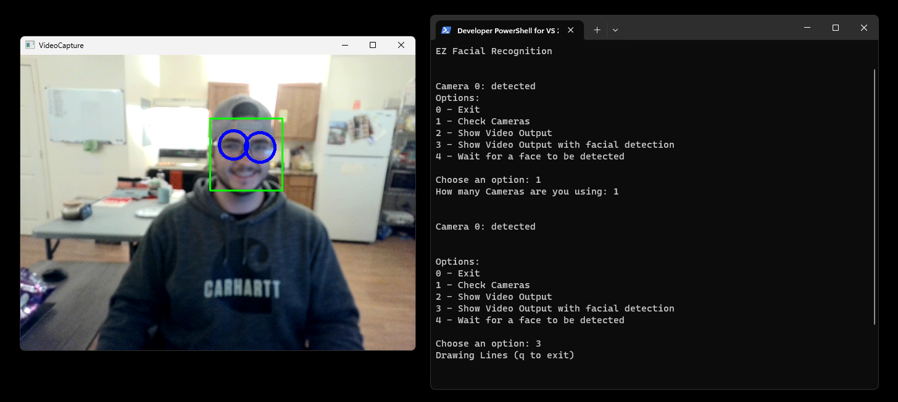

# Facial Recognition Enhanced
2/16/23
<h1>Overview</h1>
There Are 4 main functions of EZFzciaIRecognition:

 ---
 
checkCameras (numberofcaneæs)

giveoption()

showVid(drawLines=Fa1se)

detect(opticn, timeout=None)

# Setup
To import the file, simply bring it into your project files add the fonowing code to the top of your program file„.
import EZFaci31Recognition

